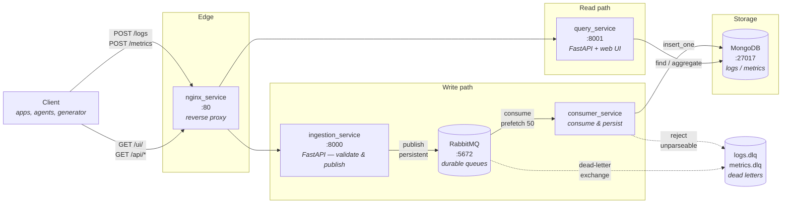

# MetricFlow

A self-hosted observability pipeline for ingesting, queueing, storing, and querying
application logs and infrastructure metrics — built entirely on open-source
components that run anywhere Docker runs.

---

## Why this project exists

### Vendor lock-in

Managed observability platforms are easy to adopt and hard to leave. The lock-in is
rarely a single contract clause — it accumulates:

- **Proprietary agents and formats.** Data is shipped through a vendor-specific
  agent into a vendor-specific storage format. There is no equivalent of "just
  point it somewhere else."
- **Query languages that don't travel.** Dashboards, saved searches, monitors, and
  alert rules are written in a query language unique to the platform. Migrating
  means rewriting all of them by hand.
- **Historical data is effectively hostage.** Export is usually rate-limited,
  partial, or billed. Leaving often means abandoning your history — which is
  precisely the asset that makes observability valuable.
- **Retention as a lever.** Because the vendor controls how long data lives, cost
  reduction and diagnostic capability are placed in direct conflict.

MetricFlow avoids this by using components with open protocols and open formats.
RabbitMQ speaks AMQP, MongoDB stores plain BSON documents, and the ingestion
contract is ordinary JSON over HTTP. Every layer can be swapped independently:
MongoDB for ClickHouse or Postgres, RabbitMQ for Kafka, the query service for
anything that speaks Mongo. The data is in your own volume, on your own disk, in a
format you can read without permission.

### Pricing

Commercial observability is typically billed per host, per ingested gigabyte, per
custom metric, and per retention tier — and the units are the ones that grow
fastest as a system succeeds. This creates a structural problem:

- **Cost scales with the exact things you want to increase.** More services, more
  instances, and more detailed instrumentation all raise the bill, so teams are
  pushed to log less at precisely the moment visibility matters most.
- **Sampling and dropped labels become budget decisions.** The data you discard to
  control spend is often the data that would have explained the incident.
- **Bills are hard to forecast.** A traffic spike or a chatty debug statement
  shipped to production can produce a surprise overage.

Self-hosting changes the cost model from per-gigabyte to plain infrastructure —
compute, disk, and the engineering time to operate it. That trade is not free, and
it is not right for every team, but it is **predictable and bounded**: ingesting ten
times more data costs more disk, not ten times the licence. For teams with steady
high volume, or with data-residency requirements that rule out third-party
processing, that predictability is the point.

### What this is not

This is a working reference pipeline, not a Datadog replacement. It does not do
distributed tracing, anomaly detection, alerting, or long-term downsampling. What
it does provide is a complete, inspectable path from HTTP request to queryable
storage that you own end to end — and a foundation those features can be built on.

---

## Architecture



The design separates the **write path** from the **read path**. They share only the
database, and neither can slow the other down: a burst of ingestion cannot make the
UI unresponsive, and an expensive query cannot cause dropped messages.

The queue between ingestion and storage is what makes that hold. Without it,
ingestion would write to MongoDB synchronously and every client would wait on disk;
if MongoDB were down, requests would fail. With it, ingestion's only job is to
validate and publish, and messages wait safely in a durable queue until the consumer
drains them.

---

## Data flow

### Write path

1. **Client → nginx (`:80`).** A client POSTs a JSON **array** of records to
   `/logs` or `/metrics`. nginx adds `X-Real-IP`, `X-Forwarded-For`, and
   `X-Forwarded-Proto`, then forwards to the ingestion service.
2. **Ingestion validates.** FastAPI checks each record against a Pydantic model. A
   malformed payload is rejected with **422** before anything is published —
   invalid data never enters the pipeline.
3. **Ingestion publishes.** Each record is published to the `metricflow` direct
   exchange with routing key `logs` or `metrics`, marked `delivery_mode=Persistent`
   so it survives a broker restart. Publishes are `mandatory=True` with publisher
   confirms, so an unroutable message raises rather than vanishing. The API returns
   **202 Accepted** — the data is queued, not yet stored.
4. **RabbitMQ holds the message.** Queues are declared `durable`, so both the queue
   and its persistent messages survive a restart.
5. **Consumer persists.** The consumer holds at most 50 unacknowledged messages
   (`prefetch_count=50`), inserts each into the matching MongoDB collection, and
   acknowledges **only after a successful write**. If it dies mid-message, RabbitMQ
   redelivers.

### Failure handling

The two failure modes are treated differently, because they need different outcomes:

| Failure | Action | Result |
| --- | --- | --- |
| Message is not valid JSON | `basic_reject(requeue=False)` | Routed to `logs.dlq` / `metrics.dlq`. Retrying malformed bytes cannot succeed. |
| MongoDB write fails | `basic_nack(requeue=True)` | Requeued and retried. Usually transient — a restarting database. |
| Broker unreachable at publish time | HTTP **503** to the client | The client learns immediately and can retry. |

Each main queue is declared with `x-dead-letter-exchange`, so rejected messages are
routed to a durable dead-letter queue rather than discarded. Failures are
inspectable after the fact in the RabbitMQ management UI.

### Read path

The query service reads MongoDB directly and serves both the JSON API and the web
UI. Queries are filtered server-side, sorted newest-first, and paginated with
`skip`/`limit`. The UI polls every five seconds so newly ingested data appears
without a reload.

---

## Services

| Service | Image / base | Port | Role |
| --- | --- | --- | --- |
| `nginx_service` | `nginx:1.27-alpine` | `80` | Reverse proxy. Single entry point; routes writes to ingestion, reads to query. |
| `ingestion_service` | `python:3.9-slim` | `8000` | FastAPI. Validates payloads and publishes to RabbitMQ. Never touches the database. |
| `rabbitmq` | `rabbitmq:3.13-management-alpine` | `5672`, `15672` | Durable message broker with dead-letter queues. Decouples ingestion from storage. |
| `consumer_service` | `python:3.9-slim` | — | Consumes both queues, writes to MongoDB, acks on success. Scales horizontally. |
| `mongo` | `mongo:7` | `27017` | Document storage. Schemaless fits varying log shapes; indexed on `(service, timestamp)`. |
| `query_service` | `python:3.9-slim` | `8001` | FastAPI read API plus the single-page web UI. |
| `generator_service` | `python:3.9-slim` | — | On-demand load generator for realistic sample data. Profile-gated. |

### Why these choices

**RabbitMQ over Kafka.** For this volume, RabbitMQ is far simpler to operate and its
per-message dead-lettering is a better fit than Kafka's offset model. Kafka earns its
complexity at much higher throughput or when multiple independent consumer groups
need to replay the same stream.

**MongoDB for storage.** Log records vary in shape, and document storage absorbs that
without migrations. For heavy metric aggregation at scale, a columnar store such as
ClickHouse would be materially faster — the queue makes that swap a
consumer-service change, not a rewrite.

**nginx as the only entry point.** One place to add TLS, rate limiting, request-size
caps, and access logging, instead of duplicating that in every service.

**Separate read and write services.** Independent scaling and independent failure.
Ingestion needs to be fast and always available; querying can be slower without
consequence.

---

## Running the project

### Prerequisites

Docker with Compose v2 (`docker compose`, not `docker-compose`). Ports `80`, `8000`,
`8001`, `5672`, `15672`, and `27017` must be free.

### Start everything

```bash
docker compose up --build
```

`--build` matters after any code or config change — nginx bakes its config into the
image with `COPY`, so a plain `up` would silently reuse a stale one.

Run detached, and follow logs:

```bash
docker compose up --build -d
docker compose logs -f
docker compose logs -f consumer_service    # one service
```

### Verify it is healthy

```bash
docker compose ps
curl localhost/health
```

RabbitMQ and MongoDB have health checks, and dependent services wait on them — so
the first start takes longer while the broker and database initialise.

### Load sample data

The generator is behind the `tools` profile, so it does **not** run on `up`:

```bash
docker compose run --rm generator_service
```

It sends a random 100–200 logs and 100–200 metrics through the full pipeline.
To control the volume:

```bash
docker compose run --rm generator_service python main.py --logs 200 --metrics 200
docker compose run --rm generator_service python main.py --seed 42   # reproducible
```

Or straight from the host — it uses only the standard library, so no install is
needed:

```bash
python3 generator_service/main.py --target http://localhost
```

### Send data by hand

Both endpoints take a JSON **array**, even for a single record:

```bash
curl -X POST localhost/logs \
  -H 'Content-Type: application/json' \
  -d '[{"message":"connection timeout to upstream","level":"ERROR","service":"api-gateway","timestamp":1754671800.123}]'
```

```bash
curl -X POST localhost/metrics \
  -H 'Content-Type: application/json' \
  -d '[{"service":"api-gateway","cpu_utilization":42.5,"ram_utilization":68.1,"disk_utilization":15.0,"timestamp":1754671800.123}]'
```

`Content-Type: application/json` is required. Sending `text/plain` makes FastAPI
treat the body as a string and reject it with `"Input should be a valid list"`.

A successful response is **202 Accepted** — queued, not yet stored. Expect a moment
before the record appears in the UI.

### Scale the consumer

```bash
docker compose up -d --scale consumer_service=3
```

RabbitMQ distributes messages across consumers automatically; no configuration
change is needed.

### Stop

```bash
docker compose down              # stop, keep data
docker compose down -v           # stop and delete volumes — destroys all data
docker compose restart nginx_service
```

---

## The web UI

Open **<http://localhost/ui/>** (through nginx) or **<http://localhost:8001>**
(directly).

| Feature | Detail |
| --- | --- |
| **Logs / Metrics tabs** | Separate views; each with the filters relevant to it. |
| **Filters** | Service, log level, message substring, and a From/To time range. |
| **Pagination** | Prev/Next with a configurable page size of 50–1000. |
| **Live refresh** | Polls every 5 seconds; toggle it with the checkbox. The green dot pulses while active. |
| **Metric bars** | CPU, RAM, and disk render as inline bars that turn red above 85%. |
| **Header stats** | Total counts and a breakdown by log level. |
| **Light and dark** | Follows the operating-system theme. |

### Read API

The UI is a client of this API; every endpoint is usable directly.

| Endpoint | Parameters |
| --- | --- |
| `GET /api/logs` | `service`, `level`, `search`, `start`, `end`, `limit`, `skip` |
| `GET /api/metrics` | `service`, `start`, `end`, `limit`, `skip` |
| `GET /api/services` | — (distinct service names) |
| `GET /api/stats` | — (counts and level breakdown) |

`start` and `end` are Unix epoch seconds. Results are newest-first.

```bash
curl 'localhost/api/logs?level=ERROR&limit=10'
curl 'localhost/api/logs?service=api-gateway&search=timeout'
curl 'localhost/api/metrics?service=payment-worker&limit=5'
curl localhost/api/stats
```

### Interactive API docs

FastAPI generates Swagger UI for both services:

- Ingestion — <http://localhost:8000/docs>
- Query — <http://localhost:8001/docs>

---

## Inspecting the infrastructure

### RabbitMQ management UI

<http://localhost:15672> — username `guest`, password `guest`.

Use it to watch queue depth, confirm messages are being consumed, and inspect
whatever landed in `logs.dlq` or `metrics.dlq`. A growing main queue means the
consumer has fallen behind or died; anything in a DLQ means messages were rejected.

### MongoDB

```bash
docker compose exec mongo mongosh metricflow
```

```javascript
show collections
db.logs.countDocuments()
db.logs.find().sort({timestamp: -1}).limit(5)
db.logs.find({level: "ERROR"}).limit(10)
db.metrics.find({cpu_utilization: {$gt: 85}})
db.logs.aggregate([{$group: {_id: "$level", n: {$sum: 1}}}])
```

From the host, use `mongodb://localhost:27017/metricflow` — in MongoDB Compass or a
local `mongosh`.

---

## Troubleshooting

**`host not found in upstream "..."` and nginx exits.** nginx resolves upstream
hostnames once at startup and hard-fails if one is missing. Confirm the hostname in
`nginx_service/nginx.conf` matches the compose **service name** exactly.

**Data posts successfully but never appears in the UI.** The write path is
asynchronous, so check it in order: is the queue draining in the RabbitMQ UI, is
`docker compose logs consumer_service` reporting errors, and does
`db.logs.countDocuments()` increase? A full queue with an idle consumer means the
consumer is down; `restart: on-failure` should recover it.

**`"Input should be a valid list"` on POST.** Either the `Content-Type` is not
`application/json`, or the body is a bare object instead of an array.

**Ingestion returns 503.** RabbitMQ is unreachable. It is likely still starting —
check `docker compose ps` for its health status.

---

## Project layout

```
metricflow/
├── docker-compose.yaml        # all services, volumes, health checks
├── nginx_service/
│   ├── nginx.conf             # routing: writes → ingestion, reads → query
│   └── dockerfile
├── ingestion_service/
│   ├── main.py                # FastAPI write endpoints
│   ├── broker.py              # RabbitMQ topology, DLQ wiring, publishing
│   ├── requirements.txt
│   └── dockerfile
├── consumer_service/
│   ├── main.py                # queue → MongoDB, with dead-lettering
│   ├── requirements.txt
│   └── dockerfile
├── query_service/
│   ├── main.py                # read API + serves the UI
│   ├── static/index.html      # single-page UI, no build step
│   ├── requirements.txt
│   └── dockerfile
└── generator_service/
    ├── main.py                # load generator (standard library only)
    └── dockerfile
```

---

## Production considerations

This configuration is built for local development. Before running it anywhere
exposed, at minimum:

- **Add authentication.** MongoDB currently runs with **no credentials** and
  RabbitMQ uses the default `guest`/`guest`. Unauthenticated MongoDB reachable from
  a network is found and wiped by automated scanners within hours.
- **Remove the published ports** for `mongo`, `rabbitmq`, `ingestion_service`, and
  `query_service`. Only nginx needs to be reachable; the rest can talk over the
  internal Compose network.
- **Terminate TLS at nginx**, and add rate limiting so a single client cannot
  saturate ingestion.
- **Bound the retry loop.** A MongoDB write failure requeues indefinitely, so a
  permanently unacceptable document (for example, one exceeding the 16 MB BSON
  limit) will retry forever. Add a delivery-count limit and dead-letter past a
  threshold.
- **Set a retention policy.** Nothing currently expires. A TTL index on `timestamp`
  or a periodic archive job keeps storage bounded.
- **Replace `skip`-based pagination** for large offsets, and add a text index if
  message search becomes slow — the current substring search cannot use an index.
